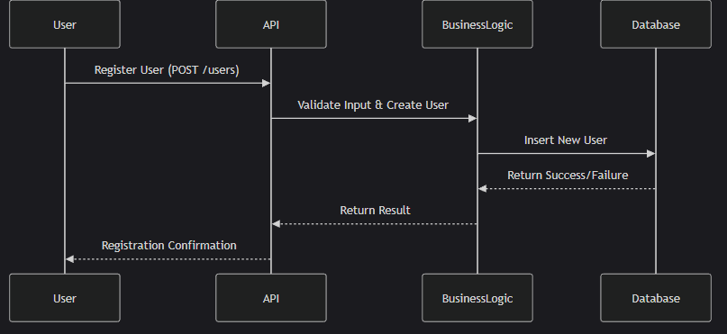
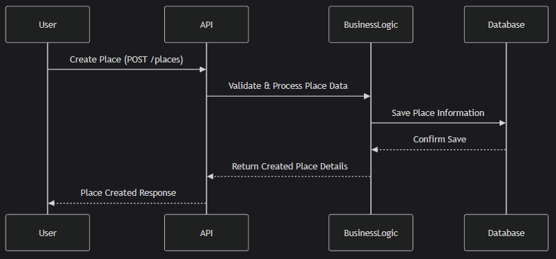
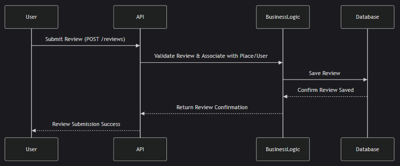
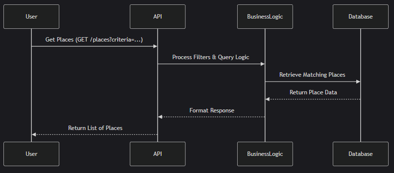

# holbertonschool-hbnb

This is a Holberton project that aims to recreate the Airbnb platform.

It includes the following diagrams:
- High-Level Package Diagram
- Detailed Class Diagram for the Business Logic Layer
- 4 Sequence Diagrams for API Calls
- Technical Document

## High-Level Package Diagram

## Class Diagram for the Business Logic Layer

## 4 Sequence Diagrams for API Calls

### Seqence diagram user registration

### Seqence diagramp place creation

### Seqence diagram review submission

### Seqence diagram fetch place

